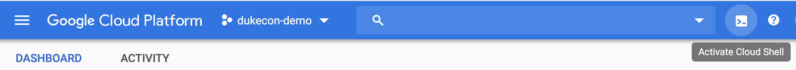

= DukeCon Kubernetes / Jenkins-X Demo
include::.asciidoctorconfig[]

:author: Gerd Aschemann
:email: gerd@aschemann.net
:twitter: @GerdAschemann

:aws!:
:jx_version: unknown

[.lead]
====
You have some Dev or Ops background (or even both) and *want to learn about* one or all of the following?

* https://kubernetes.io[Kubernetes] (k8s) — the _Cloud Operating System_?
* https://jenkins-x.io[Jenkins-X] (JX) — next generation _k8s based CI/CD solution_ provided by the makers of the famous https://jenkins.io[Jenkins] server?
* _Development and deployment of a cloud native (distributed) application to k8s_ with the help of JX — by the example of https://dukecon.org[DukeCon], the conference planner for Javaland and other community based conferences?

We will (currently) introduce you to experience these goals by some hands-on workshops and open space sessions, e.g., as
Community Activity at https://www.javaland.eu/de/programm/community-aktivitaeten/[Javaland 2020]: https://programm.javaland.eu/2020/#/scheduledEvent/591508[DukeCon on JX].

*No further knowledge of the above mentioned technologies is necessary to participate in the hands-on workshop!*
====

|===
|Author |JX Version

|{author}
|{jx_version}

|===

[IMPORTANT]
====
Please prepare your participation in the hands-on workshop carefully by completing some setup steps as described in the <<prerequisites>>.
====

The class does not require to be a Java developer, but some Java background will help to understand the examples.

[WARNING]
This is currently not a complete online _tutorial_ to introduce you to the mentioned technologies and goals.
It only provides an introduction to enable you to participate in a hands-on session at one of the mentioned events.

[[prerequisites]]
== Prerequisites

.TL;DR
****
If you are experienced to run a local machine with OSX or Linux (even as a VM) and install and use developer and operator tools, you may directly jump to the respective installation and preparation parts for

* <<github-account>>,
* <<cloud-account>>, and
* <<shell_and_tools>>.
****

[CAUTION]
====
*Medium Level Skills minimum*: The class is aiming at people with at least medium level development or operations experience.
You should be used to work with tools like Git, a Shell and an IDE (optional, at least an editor like `vi` or `emacs` is required).
====

To take part of the hands-on session you need to prepare the following accounts and tools.
You need to run some tools from either a local machine (Laptop), or a network (cloud) machine where you have shell access.

[[setup]]
[[github-account]]
=== Github Account

[.lead]
====
During the workshop we will make heavy use of Github to store and share development and infrastructure projects.
Therefore, you need to have a public Github account.

NOTE: _Feel free to delete all the stuff from your Github account after you have finished the workshop._
====

If you do not have a https://github.com[Github] account, create one (it's free!).

[[cloud-account]]
=== Cloud Account

[.lead]
====
You need to have an account with one of the public cloud providers to participate in the workshop: Google (currently recommended), Microsoft, Amazon, or one of the many others who provide managed k8s.
Almost all of them have a free plan, which allows to allocate the necessary resources (VMs, networks etc.).

NOTE: _It is not required to have preliminary experience with these cloud environments — all the necessary knowledge is covered in the workshop._
====

K8s can be run on a great variety of public clouds as well as on-premises, and you probably have a private cloud with k8s already at hand?
You may even consider running k8s on your local machine by Vagrant/VirtualBox, Qemu, or Minikube.
JX also claims to run with an increasing number of cloud providers.

Nevertheless, from our experience the _big_ cloud providers Google Cloud Platform (GCP) and Amazon Web Services (AWS) provide the best way to complete the examples.
According to our experiences they both provide the most stable environments (for JX) and the fastest infrastructure.
Please get yourself one of the following accounts and perform the necessary steps to install k8s and JX on your account.

[CAUTION]
In order to give optimal support to all participants of the hands-on sesseion we will only be able to help you if you make use of the mentioned cloud providers (i.e., <<google-cloud-account>>).
Local or private installations must not be used in the course of the session.

[[google-cloud-account]]
==== GCP / GKE account

[NOTE]
.GKE
====
On the Google Cloud Platform we will use a managed Kubernetes, called Google Kubernetes Engine (GKE).
====

Create a Google cloud account if you do not already have one: https://cloud.google.com/[]

* You need a Google user account if you do not have one already (may be created in the course of the cloud account setup),
* Google provides a free plan for some time (cf. https://cloud.google.com/free/[]),
* If you do not belong to the free plan any longer (if you already have used your free resources), running k8s / JX for only a few hours during the class will cost a few EURs (< 2 per hour).

==== AWS / EKS account

ifdef::aws[]
[NOTE]
.EKS
====
In the Amazon Web Services cloud we will use a managed Kubernetes, called Elastic Kubernetes Services (EKS).
====

* Create AWS cloud account if you do not already have one:
** AWS provides a free plan fo some time (cf. https://aws.amazon.com/free/[])
** Press the _Create a Free Account_ button https://aws.amazon.com/free/[there]
* Install `eksctl`:
** You may try the link:bin/install-eks[] shell script (at least for Ubuntu/Debian or OSX),
** *or* Follow the instructions in https://eksctl.io/usage/creating-and-managing-clusters/[]

endif::aws[]
ifndef::aws[]

[IMPORTANT]
====
Amazon Setup will be completed soon!
====
endif::aws[]

[[shell_and_tools]]
=== Shell and Tools

[.lead]
====
A (Unix) _shell_ and some _shell tools_ are necessary to participate in the workshop.

[NOTE]
If we talk of local tools or _a local machine_, a remote machine with shell access (e.g., via `ssh` or a Google Cloud shell) is also covered.

[TIP]
If you want to avoid all local installations *we recommend to make use of the Google Cloud Shell* of your <<google-cloud-account>>.
_In this case you may skip the following installation steps_: Switch to <<google-cloud-shell>> and skip the remainder of this local installation section.
====

Your local machine does not need to be extremely powerful, though we recommend having at least 8 GB of RAM to run a local Java IDE (IntelliJ) if desired.
The _real work_ is performed by some cloud provider, e.g., GCP or AWS.

[CAUTION]
====
*Local Administrator Rights required:* You need to be able to run administrative tasks on your local or remote/ssh machine like performing the required <<tool-installation>>.
====

We strongly recommend to make use of a Unix-like operating systems, e.g., OSX (MacOS) or Linux.

[[windows]]
.Windows Users
****
If you need to work with Windows, you should at least have a `bash` (e.g., provided by https://git-scm.com/download/win[git for Windows]).
Better results should be possible with Windows Linux Subsystem (WLS) as of current versions of Windows 10.

*Note*: We are not able to test a git bash or WLS based install due to a lack of access to a respective machine.
If you have the possibility to run this setup with Win10, we are happy about a change request to https://github.com/dukecon/dukecon-jx-demo[this repository]!

If all else fails please consider installing a small VM (2 GB RAM) with Linux (Ubuntu or Debian).
You may use Vagrant (cf. <<vagrant>>) and VirtualBox to set it up.
****

If you have a remote Linux machine (in the cloud) available you may also use it. Please make sure you have your cloud credentials on this machine.

[[tool-installation]]
==== Tool installation

Please perform the following steps on your local machine (or remote via `ssh` login).
We are not able to explain in detail the installation of the tools.
You may use it as a first check if you are able to follow the class, iff you are able to complete the requirements section and install the tools and accounts.

** `git` (can be installed on most Linux/Unix distributions via the respective package manager, e.g., Homebrew or `apt`, <<windows>> users should install from https://git-scm.com/downloads[])
** a Shell (e.g., git `bash`, when running on Windows (<<windows>>))
** Docker (highly depends on your OS and skills):
OSX:: Newer versions do have Docker Desktop installed (cf. https://www.docker.com/products/docker-desktop[]);
Linux:: Installation depends on your distribution and package manager;
Windows:: Install Docker for Desktop manually (cf. https://www.docker.com/products/docker-desktop[])

If you run into any problems, *please consider using <<google-cloud-shell>> instead!*

[[getting-started]]
== Getting started

[CAUTION]
====
If you can't wait for the workshop day to start, you may proceed *on your own risk* from here.

Make sure you have at least completed the setup according to the <<prerequisites>> so far!

Be aware that setting up infrastructure/resources in your cloud account *may cause fees being charged* to you depending on the kind of resources (machines, IPs, load balancers etc.) and if you have a free plan.

.Remove resources when you're done!
****
If you are finished with your work you probably want to remove your cloud resources in order to avoid being charged by the cloud provider, cf. <<cleanup>>.
****
====

=== Get and start Docker container

* Checkout (clone) this repository from https://github.com/dukecon/dukecon-jx-demo[] (or via ssh: `github@github.com:dukecon/dukecon-jx-demo`);
* Go to the new directory: `cd dukecon-jx-demo`;
* Set environment:
+
  export DUKECON_JX_VERSION=:latest

* Get prepared JX Docker image
+
  docker-compose pull jx

* Run prepared Docker image as new container
+
  docker-compose run jx

* Optionally start `screen` within Docker container (to be able to start and switch to different shell sessions)
+
  screen

[[prepare-cloud]]
=== Prepare your Cloud Account

Log in to your cloud account and perform further setup

GKE::
* `gcloud auth login` # This will either open a browser session or show (a long) URL (please open with browser then) and follow instructions
* Create a new project: https://console.cloud.google.com/projectcreate[], e.g., `jx-demo`
* Smoketest: Check if the project is created with `gcloud projects list`
* Set the new project as default: `gcloud config set project <project>`
ifdef::aws[]
AWS::
TBD
endif::aws[]

=== Create Jenkins X

Run the following command to get your first cluster going (you may follow almost all defaults of the interactive wizard):

GKE::
* `jx create cluster gke --skip-login` (make sure the login went well in <<prepare-cloud,the prepare step>>)
ifdef::aws[]
AWS::
TBD
endif::aws[]

[appendix]
[[google-cloud-shell]]
== Google Cloud Shell

If you want to use Google Cloud Shell:

* Open https://console.cloud.google.com[Google Cloud Console]
* Activate the Cloud Shell
+

[TIP]
Skip <<shell_and_tools>> installation if you go this way;
Proceed with <<getting-started>>.

[appendix]
[[cleanup]]
== Cleanup

=== Destroy Cloud Infrastructure

If you want to destroy your cluster, please perform the following commands.

GKE::
** `gcloud container clusters list` # Then check the name and zone (Location) of your created cluster here
** `gcloud container clusters delete -z <location> <name>` # insert location and name
** `jx gc gke` # This creates a local cleanup script `gc_gke.sh`
** `./gc_gke.sh` # Execute final cleanup
ifdef::aws[]
AWS::
TBD
endif::aws[]

=== Hibernate Cloud Infrastructure

TBD

[appendix]
== Links

* https://jenkins-x.io/docs/getting-started/setup/[Setup Jenkins-X]

[appendix]
[[manual-tool-installation]]
== Manual (local) Tool Installation

If you want to install all tools provided by the JX Docker image locally (e.g. for testing), check out the <<docker-installation-steps>> and call the respective scripts manually.
Or look into the scripts and execute the installation on your own.

[[docker-installation-steps]]
[source, shell]
.Docker Installation Steps
----
include::../../../docker/Dockerfile[tags=install-tools]
----

These scripts (link:setup/[]]) install the tools:

`hub`:: is a nice CLI tool to work with GitHub from your local shell

`screen` (optional):: enables working with multiple shell sessions in parallel and allows to resume the shell sessions if your remote connection was broken.
It is not only helpful if running on Vagrant and/or remote machine, but also to share environments for parallel terminal sessions (set environment variables once, then start `screen`).

`helm`:: Is used internally as k8s package manager by Jenkins-X.
You may need to use it occasionally, e.g., when tracking errors.

`jx` (Jenkins-X CLI)::
** Try to run the link:setup/install-jx[] shell script, *or*
** Follow the instructions in https://jenkins-x.io/docs/getting-started/setup/install/[]

`gcloud`:: Used to interact with the Google Cloud API (used by JX, but also from you)
+
[NOTE]
If you are running on <<google-cloud-shell>> this is already installed.

Some of the installers may install more tools if necessary, e.g.,

`kubectl`:: Control your k8s from the CLI (https://kubernetes.io/docs/tasks/tools/install-kubectl/[])

ifdef::aws[]
//** AWS
//*** `kops`, and
//*** `aws` (optional)
endif::aws[]

[appendix]
[[vagrant]]
== Vagrant Setup

We have prepared a https://www.vagrantup.com/[Vagrant] Virtual Machine setup for your convenience if you do not have the opportunity to run on OSX/Linux/Docker or if you do not want to leave any of the tools on your local machine.
Just go to the root of this repository (your local clone of it) and run

* `./bin/vagrant-up` (may take some time if you have to download the vagrant box for the first time),
* `vagrant ssh` to log into the new VM.

Proceed from here with the additional setup (cf. <<prerequisites>>).
